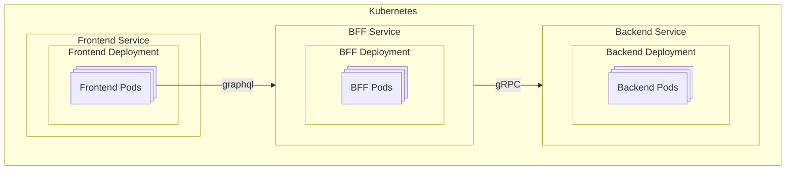

# Node.js Application Architecture

```mermaid
flowchart LR
    subgraph k8s [Kubernetes]
      direction LR

      subgraph fesvc [Frontend Service]
          direction LR
          subgraph fedep [Frontend Deployment]
              direction LR
              fep@{ shape: procs, label: "Frontend Pods"}
          end
      end
      subgraph bffsvc [BFF Service]
        direction LR
        subgraph bffdep [BFF Deployment]
          direction LR
          bffp@{ shape: procs, label: "BFF Pods"}
        end
      end
      subgraph besvc [Backend Service]
        direction LR
        subgraph bedep [Backend Deployment]
          direction LR
          bep@{ shape: procs, label: "Backend Pods"}
        end
      end
      fep -- graphql --> bffsvc -- gRPC --> besvc
    end
```
