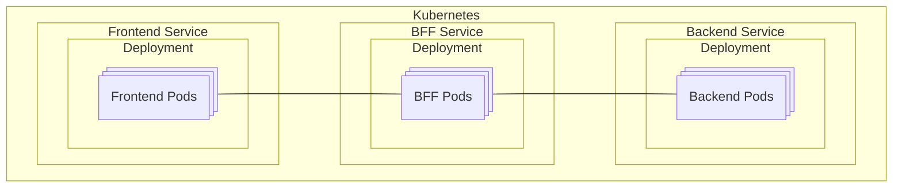

# Node.js Application Architecture

```mermaid
flowchart LR
    subgraph k8s [Kubernetes]
      direction LR
      subgraph fesvc [Frontend Service]
        direction LR
        subgraph fedep [Deployment]
          direction LR
          fep@{ shape: procs, label: "Frontend Pods"}
        end
      end
      subgraph bffsvc [BFF Service]
        direction LR
        subgraph bffdep [Deployment]
          direction LR
          bffp@{ shape: procs, label: "BFF Pods"}
        end
      end
      subgraph besvc [Backend Service]
        direction LR
        subgraph bedep [Deployment]
          direction LR
          bep@{ shape: procs, label: "Backend Pods"}
        end
      end
      fep --- bffp --- bep
    end
```
