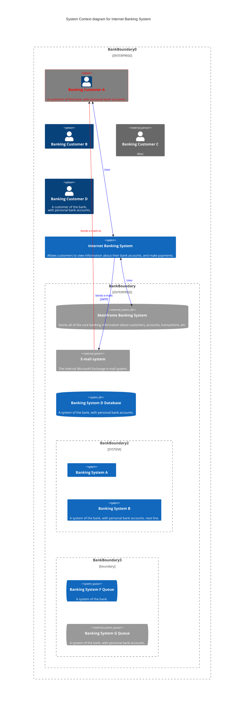
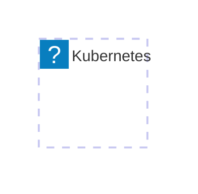

# Node.js Application Architecture

```mermaid
    C4Context
      title System Context diagram for Internet Banking System
      Enterprise_Boundary(b0, "BankBoundary0") {
        Person(customerA, "Banking Customer A", "A customer of the bank, with personal bank accounts.")
        Person(customerB, "Banking Customer B")
        Person_Ext(customerC, "Banking Customer C", "desc")

        Person(customerD, "Banking Customer D", "A customer of the bank, <br/> with personal bank accounts.")

        System(SystemAA, "Internet Banking System", "Allows customers to view information about their bank accounts, and make payments.")

        Enterprise_Boundary(b1, "BankBoundary") {

          SystemDb_Ext(SystemE, "Mainframe Banking System", "Stores all of the core banking information about customers, accounts, transactions, etc.")

          System_Boundary(b2, "BankBoundary2") {
            System(SystemA, "Banking System A")
            System(SystemB, "Banking System B", "A system of the bank, with personal bank accounts. next line.")
          }

          System_Ext(SystemC, "E-mail system", "The internal Microsoft Exchange e-mail system.")
          SystemDb(SystemD, "Banking System D Database", "A system of the bank, with personal bank accounts.")

          Boundary(b3, "BankBoundary3", "boundary") {
            SystemQueue(SystemF, "Banking System F Queue", "A system of the bank.")
            SystemQueue_Ext(SystemG, "Banking System G Queue", "A system of the bank, with personal bank accounts.")
          }
        }
      }

      BiRel(customerA, SystemAA, "Uses")
      BiRel(SystemAA, SystemE, "Uses")
      Rel(SystemAA, SystemC, "Sends e-mails", "SMTP")
      Rel(SystemC, customerA, "Sends e-mails to")

      UpdateElementStyle(customerA, $fontColor="red", $bgColor="grey", $borderColor="red")
      UpdateRelStyle(customerA, SystemAA, $textColor="blue", $lineColor="blue", $offsetX="5")
      UpdateRelStyle(SystemAA, SystemE, $textColor="blue", $lineColor="blue", $offsetY="-10")
      UpdateRelStyle(SystemAA, SystemC, $textColor="blue", $lineColor="blue", $offsetY="-40", $offsetX="-50")
      UpdateRelStyle(SystemC, customerA, $textColor="red", $lineColor="red", $offsetX="-50", $offsetY="20")

      UpdateLayoutConfig($c4ShapeInRow="3", $c4BoundaryInRow="1")
```

```mermaid
architecture-beta
    group k8s(logos:kubernetes)[Kubernetes]
```

```mermaid
flowchart LR
    classDef all fill:transparent,stroke-width:1px
    classDef virtual fill:transparent,stroke:gray,stroke-width:1px,strokeDasharray: 5 5

    user@{ icon: "fa:user", form: "circle", label: "User", pos: "b", h: 60 }
    subgraph k8s[Kubernetes]
        direction LR
        subgraph fe[Frontend]
            direction LR
            feSvc@{ shape: rect, label: "Service" }
            subgraph feDeployment[Deployment]
                subgraph fePod[Pod]
                    direction LR
                    subgraph feContainer[Contaner]
                        direction LR
                        feContainer1@{ shape: rect, label: "Next.js" }
                    end
                end
            end
            feSvc --> feDeployment
        end
        subgraph bff[Backend For Frontend]
            direction LR
            bffSvc@{ shape: rect, label: "Service" }
            subgraph bffDeployment[Deployment]
                direction LR
                subgraph bffPod[Pod]
                    direction LR
                    subgraph bffContainer[Contaner]
                        direction LR
                        bffContainer1@{ shape: rect, label: "Nest.js" }
                    end
                end
            end
            bffSvc --> bffDeployment
        end
        subgraph be[Backend]
            direction LR
            beSvc@{ shape: rect, label: "Service" }
            subgraph beDeployment[Deployment]
                direction LR
                subgraph bePod[Pod]
                    direction LR
                    subgraph beContainer[Contaner]
                        direction LR
                        beContainer1@{ shape: rect, label: "Nest.js" }
                    end
                end
            end
            beSvc --> beDeployment
        end
    end

    class k8s all
    class feSvc,bffSvc,beSvc all
    class feDeployment,bffDeployment,beDeployment all
    class fePod,bffPod,bePod all
    class feContainer,bffContainer,beContainer all
    class feContainer1,bffContainer1,beContainer1 all

    class fe,bff,be virtual

    postgres@{ shape: cyl, label: "PostgreSQL" }
    redis@{ shape: cyl, label: "Redis" }
    mongo@{ shape: cyl, label: "MongoDB" }
    class db all
    class postgres,redis,mongo all

    user -- HTTPS --> feSvc
    fePod -- graphql --> bffSvc
    bffPod -- gRPC --> beSvc
    beContainer1 --> postgres
    beContainer1 --> redis
    beContainer1 --> mongo
```
