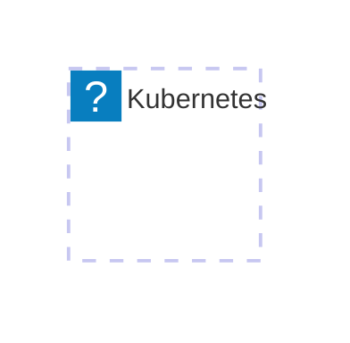

# Node.js Application Architecture

```mermaid
architecture-beta
    group k8s(logos:kubernetes)[Kubernetes]
```

```mermaid
flowchart LR
    classDef all fill:transparent,stroke-width:1px
    classDef virtual fill:transparent,stroke:gray,stroke-width:1px,strokeDasharray: 5 5

    user@{ icon: "fa:user", form: "circle", label: "User", pos: "b", h: 60 }
    subgraph k8s[Kubernetes]
        direction LR
        subgraph fe[Frontend]
            direction LR
            feSvc@{ shape: rect, label: "Service" }
            subgraph feDeployment[Deployment]
                subgraph fePod[Pod]
                    direction LR
                    subgraph feContainer[Contaner]
                        direction LR
                        feContainer1@{ shape: rect, label: "Next.js" }
                    end
                end
            end
            feSvc --> feDeployment
        end
        subgraph bff[Backend For Frontend]
            direction LR
            bffSvc@{ shape: rect, label: "Service" }
            subgraph bffDeployment[Deployment]
                direction LR
                subgraph bffPod[Pod]
                    direction LR
                    subgraph bffContainer[Contaner]
                        direction LR
                        bffContainer1@{ shape: rect, label: "Nest.js" }
                    end
                end
            end
            bffSvc --> bffDeployment
        end
        subgraph be[Backend]
            direction LR
            beSvc@{ shape: rect, label: "Service" }
            subgraph beDeployment[Deployment]
                direction LR
                subgraph bePod[Pod]
                    direction LR
                    subgraph beContainer[Contaner]
                        direction LR
                        beContainer1@{ shape: rect, label: "Nest.js" }
                    end
                end
            end
            beSvc --> beDeployment
        end
    end

    class k8s all
    class feSvc,bffSvc,beSvc all
    class feDeployment,bffDeployment,beDeployment all
    class fePod,bffPod,bePod all
    class feContainer,bffContainer,beContainer all
    class feContainer1,bffContainer1,beContainer1 all

    class fe,bff,be virtual

    postgres@{ shape: cyl, label: "PostgreSQL" }
    redis@{ shape: cyl, label: "Redis" }
    mongo@{ shape: cyl, label: "MongoDB" }
    class db all
    class postgres,redis,mongo all

    user -- HTTPS --> feSvc
    fePod -- graphql --> bffSvc
    bffPod -- gRPC --> beSvc
    beContainer1 --> postgres
    beContainer1 --> redis
    beContainer1 --> mongo
```
