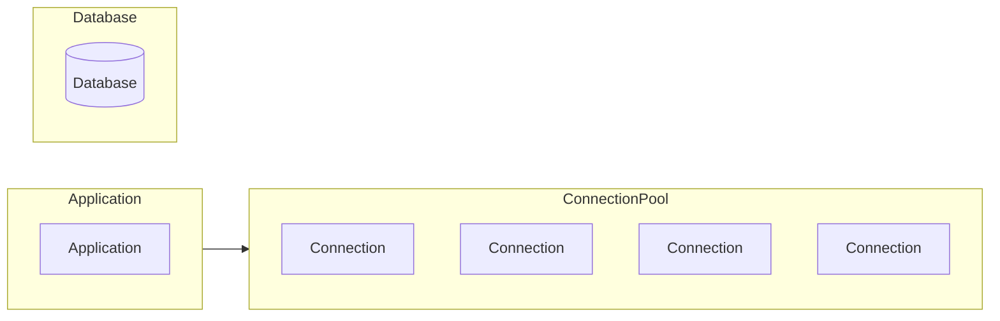

# DB Connection pool

```mermaid
flowchart LR
  subgraph Application
    APP[Application]
  end
  subgraph ConnectionPool
    direction TB
    C1[Connection]
    C2[Connection]
    C3[Connection]
    C4[Connection]
  end
  subgraph Database
    DB[(Database)]
  end
  Application --> ConnectionPool
```
