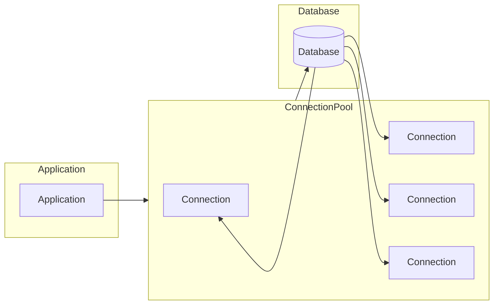

# DB Connection pool

```mermaid
flowchart LR
  subgraph Application
    APP[Application]
  end
  subgraph ConnectionPool
    C1[Connection]
    C2[Connection]
    C3[Connection]
    C4[Connection]
  end
  subgraph Database
    DB[(Database)]
  end
  APP --> ConnectionPool
  ConnectionPool --> DB
  DB --> C1
  DB --> C2
  DB --> C3
  DB --> C4
```
