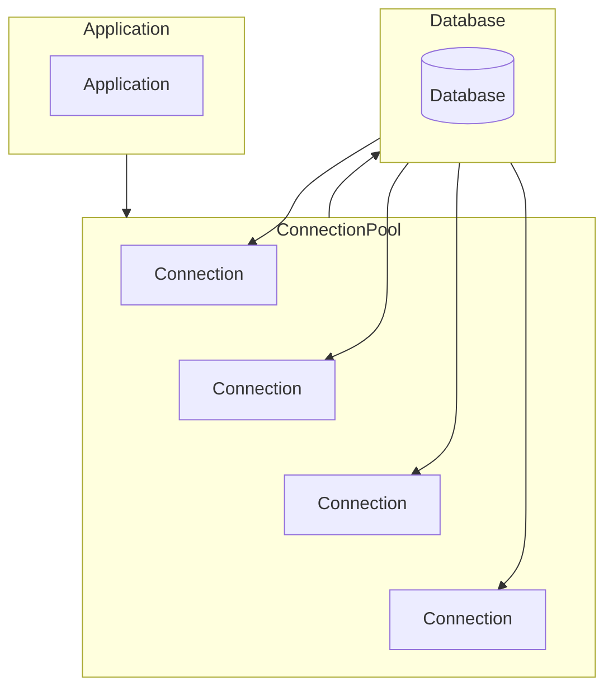

# DB Connection pool

```mermaid
flowchart TB
  subgraph Application
    APP[Application]
  end
  subgraph ConnectionPool
    direction TB
    C1[Connection]
    C2[Connection]
    C3[Connection]
    C4[Connection]
    C1 ~~~ C2
    C2 ~~~ C3
    C3 ~~~ C4
  end
  subgraph Database
    DB[(Database)]
  end 
  Application --> ConnectionPool --> Database
  Database --> C1
  Database --> C2
  Database --> C3
  Database --> C4
```
