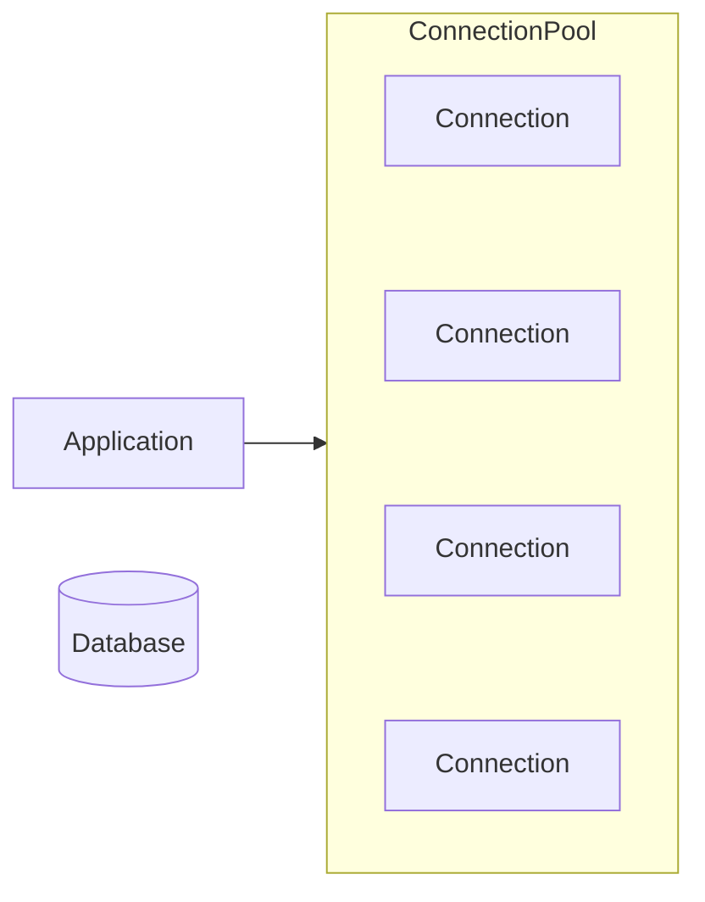

# DB Connection pool

```mermaid
flowchart LR
  APP[Application]
  DB[(Database)]
  subgraph ConnectionPool
    direction TB
    C1[Connection]
    C2[Connection]
    C3[Connection]
    C4[Connection]
    C1 ~~~ C2
    C2 ~~~ C3
    C3 ~~~ C4
  end
  APP --> ConnectionPool
```
