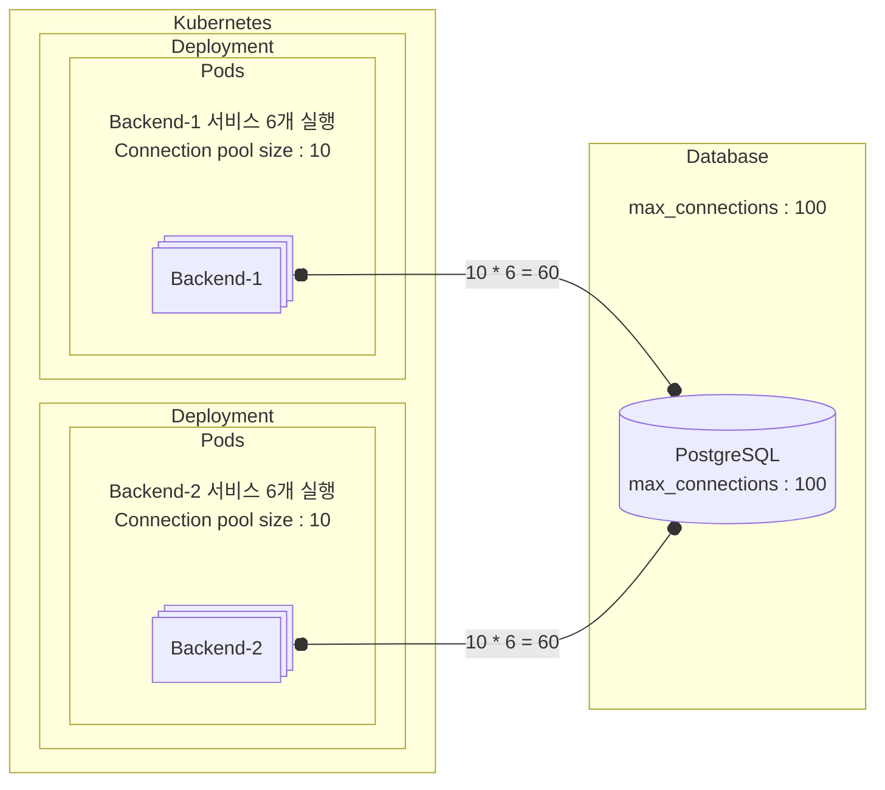
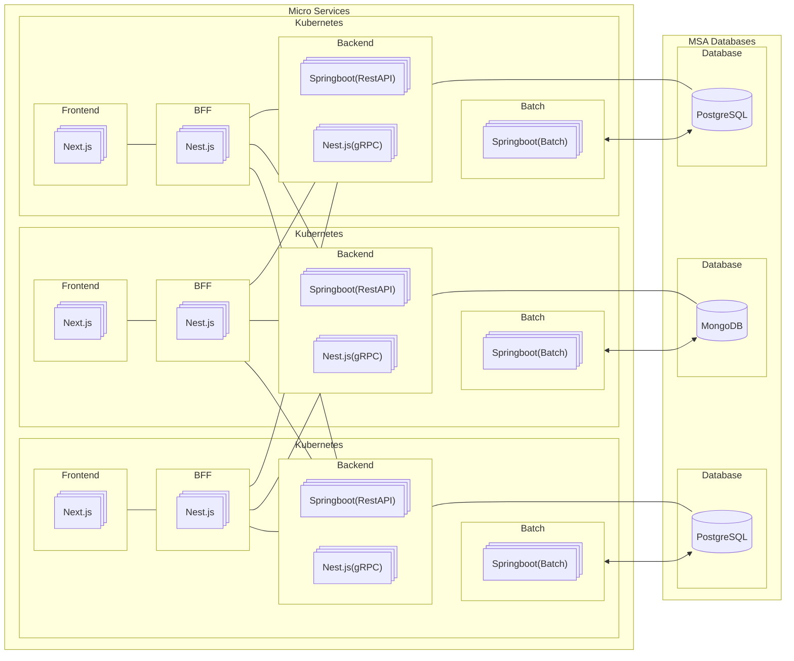

# Connection pool

## DB Connection?

1. WAS(Web Application Server)는 요청에 따라 Thread를 생성해 비즈니스 로직을 수행합니다.
1. 비즈니스 로직 수행을 위해 Database에서 Data를 가져와야하는데 Database 접속을 하게됩니다.

## Connection pool?

1. WAS(Web Application Server)가 실행될 때 미리 설정된 양만큼 Database에 Connection된 객체들을 만들어 Pool에 저장해둡니다.
1. 비즈니스 로직을 수행 중 Database에서 Data를 가져올 때 Connection 객체를 빌려주었다가 완료되면 다시 반납받아 Pool에 저장해둡니다.
1. Connection pool이 커지면 Memory 소모가 커지지만 동시성이 좋아져 Client 요청의 대기 시간이 감소합니다.

## 왜 Connection 객체를 준비해둘까?

1. 서버의 부하를 줄일 수 있습니다.
    - Database Connection을 맺는 과정의 부하가 큽니다.
    - 미리 생성하고 재활용하는 방식을 통해 부하를 줄일 수 있습니다.

## PostgreSQL에서 Max connection 확인하는 방법

```sql
select * from pg_catalog.pg_settings where name = 'max_connections';
```

| name            | setting | ... | 설명 |
| ---             | ---     | ---: | ---: |
| max_connections | 100     | ... | 100이 기본값입니다 |

## MSA 에서 Connection pool


- Database와 연결된 Backend-1, Backend-2 서비스를 각 3개씩 실행하였습니다.
- Backend-1, Backend-2 서비스는 Connection pool 을 10으로 설정했습니다.
- Backend-1, Backend-2 서비스가 3개씩 실행되었으니 현재 Connection 수는 60입니다.
- Database의 max_connections 는 100입니다.
- 현재 Database에 남은 Connection은 40입니다.



- Application이 수평확장하게 되었습니다.
- Backend-1, Backend-2 서비스가 각 6개씩 실행되었습니다.
- 필요한 Connection 수는 120입니다.
- 하지만, Database의 max_connections는 100이기 때문에 too many connections 에러가 발생하게 됩니다

### max_connections을 늘리면 안될까?

- max_connections을 늘릴 수 있습니다.
- 하지만 무한히 늘어나는 것은 아닙니다.
- 아래는 PostgreSQL max_connections 계산 방법입니다.
- (다른 DB도 동일한지는 모릅니다.)

---

- PostgreSQL에서 각 Connection은 work_mem을 기본적으로 할당받습니다.
- 예를들어 work_mem이 4MB로 설정된 경우 Connection이 100개라면 400MB의 memory를 소비합니다.
- 따라서, max_connections 값을 설정할 때 시스템 memory 용량을 고려해야합니다.
- 예를 들어, 시스템의 총 memory가 16GB이고, 운영체제 및 기타 프로세스에서 4GB를 사용할 예정이라면 PostgreSQL에 사용할 수 있는 memory는 12GB입니다.
- 이 memory를 각 연결이 사용하는 memory와 고려하여 계산해야 합니다.

#### max_connections 계산 방법

```
사용 가능한 memory / (각 연결이 사용하는 memory)
```

- 위 계산식을 위해서 아래 정보가 필요합니다.

```sql
select * from pg_catalog.pg_settings where name in ('max_connections', 'work_mem', 'shared_buffers', 'maintenance_work_mem');
```

| name                 | setting | unit | ... | 설명 |
| ---                  | ---     | ---  | --- | --- |
| maintenance_work_mem | 65536   | kB   | ... | 65536이 기본값입니다 |
| max_connections      | 100     |      | ... | 100이 기본값입니다 |
| shared_buffers       | 16384   | 8kB  | ... | 16384이 기본값입니다 |
| work_mem             | 4096    | kB   | ... | 4096이 기본값입니다 |

* shared_buffers 의 unit 은 8kb라고 되어있습니다.
* shared_buffers 의 실제 크기는 setting 값 * 8kB 입니다.
* 따라서 shared_buffers = 16384 * 8kB = 131072kB(128KB) 입니다.

1. 서버 Memory 사양

    |      |      |
    | ---: | ---: |
    | Total memory | 16GB = 16,384MB = 16,777,216kB |
    | OS 및 기타 프로세스에서 사용하는 memory | 4GB = 4,096MB = 4,194,304kB |
    | PostgreSQL에서 사용할 수 있는 memory | 16,777,216kB − 4,194,304kB = 12,582,912kB ||


1. PostgreSQL 설정

    |      |      |
    | ---: | ---: |
    | maintenance_work_mem | 65,536kB |
    | shared_buffers | 131,072kB |
    | work_mem | 4,096kB |

1. PostgreSQL 고정 memory 계산
    |      |      |
    | ---: | ---: |
    | shared_buffers + maintenance_work_mem | 고정 memory |
    | 131,072kB + 65,536kB | 196,608kB |

1. 동적으로 사용할 수 있는 memory 계산
    |      |      |
    | ---: | ---: |
    | PostgreSQL에서 사용할 수 있는 memory - 고정 memory | 동적으로 사용할 수 있는 memory |
    | 12,582,912kB - 196,608kB | 12,386,304kB |

1. 연결당 memory 계산

    |      |      |
    | ---: | ---: |
    | work_mem + PostgreSQL 오버헤드 | 연결당 memory |
    | 4,096kB + 10,240kB | 14,336kB |
    - PostgreSQL 오버헤드: 약 10MB (10,240kB로 가정)
        - (쿼리 실행 시간, CPU 사용 시간, 디스크 I/O 및 대기 이벤트를 분석해야 합니다.)
        - (아직은 잘 모르겠습니다.)

1. max_connections 계산

    |      |      |
    | ---: | ---: |
    | 동적으로 사용할 수 있는 memory / 연결당 memory | max_connections |
    | 12,386,304kB / 14,336kB | 846 |

    - 안정성을 고려하여 80~90% 수준으로 설정하는 것이 권장됩니다.
    
    | 846 | |
    | ---: | ---: |
    | 90%  | 761  |
    | 80%  | 691  |
    | 70%  | 605  |

#### PostgreSQL max_connections 설정 방법

- postgresql.conf 파일을 수정합니다.
- 기본값인 100으로 설정되어 있습니다.

```
...
max_connections = 100 # (change requires restart)
...
```

- 위에서 계산한 80%값인 691로 수정합니다.

```
...
max_connections = 691 # (change requires restart)
...
```

- postgresql을 재시작합니다.

### Appication Connection pool size 계산 방법

- CPU 코어 수 : Application 서버의 CPU 코어 수
- [사용자 요청의 대기 시간 비율](#사용자-요청의-대기-시간-비율) : Application CPU 사용 작업 대비 I/O 작업 비율
- PostgreSQL max_connections : PostgreSQL에서 허용하는 최대 연결 수
- 공식은 아래와 같습니다.

```
Connection pool size = CPU 코어 수 * (1 + 사용자 요청의 대기 시간 비율)
```

- 예를 들어
    - [CPU 코어 수](#cpu-코어-수) : 4
    - 사용자 요청의 대기 시간 비율 : 2(I/O 작업 비율이 CPU 작업의 2배라면)
    - Connection pool size = 4 * (1+2) = 12

### 그래서 결론은?

1. Connection pool 사용

    - Connection pool을 적절하게 설정하도록 합니다.

1. Read replica 구성

    - Read는 Read replica에서 처리하도록 합니다.
    - Write는 Main database에서 처리하도록 분리하여 Database의 연결 부하를 분산할 수 있습니다.
    - 이를 통해 Read 작업이 많을 경우, Database의 연결 수를 분산시켜 max_connections를 초과하지 않도록 할 수 있습니다.

1. Database 분리

    - Micro service 하나 당 Database 하나로 설계합니다.
    - 하나의 service에서는 하나의 Database를 연결할 수 있도록 합니다.



#### 사용자 요청의 대기 시간 비율

- Application의 작업을 CPU, I/O 바운드로 분류해야 합니다.
- CPU 바운드 작업 : 주로 계산 작업, 데이터 변환, 인메모리 연산 등이 포함됩니다.
- I/O 바운드 작업 : 데이터베이스 쿼리, 네트워크 요청, 파일 입출력 등이 포함됩니다.
- 측정을 위해서 Prometheus + Grafana를 사용할 수 있습니다.
    - request_duration_seconds : 전체 요청 처리 시간
    - cpu_processing_seconds : CPU 처리 시간
    - I/O 바운드 = request_duration_seconds - cpu_processing_seconds

#### CPU 코어 수

- Cloud Platform을 사용하다보면 vCPU를 보실 수 있습니다.
- vCPU(Virtual CPU)는 클리우드 환경에서 물리적 CPU를 논리적 분할로 제공횝니다.
- Cloud에서 제공하는 vCPU의 성능은 물리적 CPU에 따라 다르지만 주어진 vCPU 리소스의 90%를 계산하는 방식은 기본적으로 동일합니다.
    - 예를 들어 vCPU 4로 설정된 서버라고 한다면
    - 각 vCPU는 100%자원 사용 가능합니다.
    - 총 사용량은 4 * 100% = 400%(vCPU의 총 리소스)
    - vCPU의 총 리소스 중 90%를 사용하게 됩니다.
    - 따라서 4vCPU 기준 400% * 0.9 = 360%입니다.
    - 물리 CPU의 제한이 아닌 vCPU의 90% 리소스를 사용합니다.
- AWS, Azure, GCP 등과 같은 Cloud platform에서 제공하는 vCPU는 물리적 코어의 하이퍼스레딩(Hyper-Threading)으로 구성된 경우가 많습니다.
- 1 물리적 코어 = 2 vCPU
- 따라서 CPU 코어 수가 4인데 vCPU라면 코어 수는 2로 계산하셔야 합니다.

