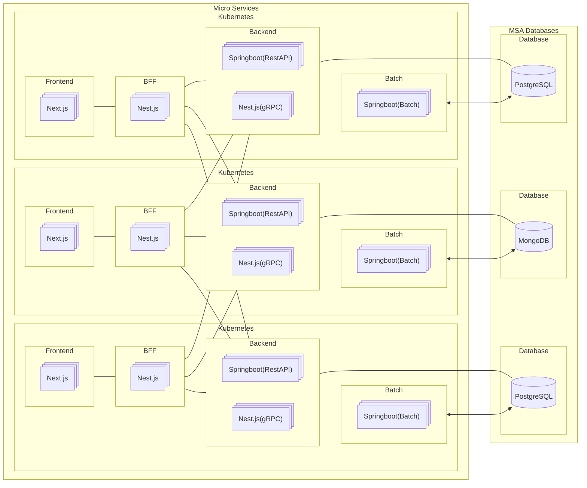

# Architecture

- Frontend, BFF(Backend For Frontend), Backend, Batch, Database로 구성된 예시입니다.
- Frontend와 BFF(Backend For Frontend)는 1:1로 호출하게 됩니다.
- Backend와 Database는 1:1로 연결됩니다.
- Batch와 Database는 1:1로 연결됩니다.
- BFF(Backend For Frontend)는 여러 Backend와 호출할 수 있어야 합니다.

